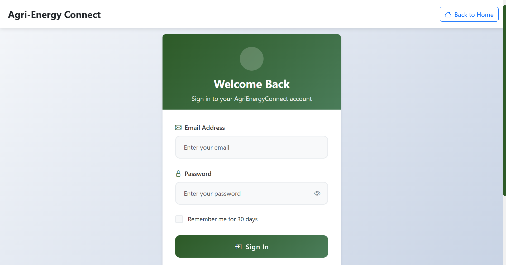
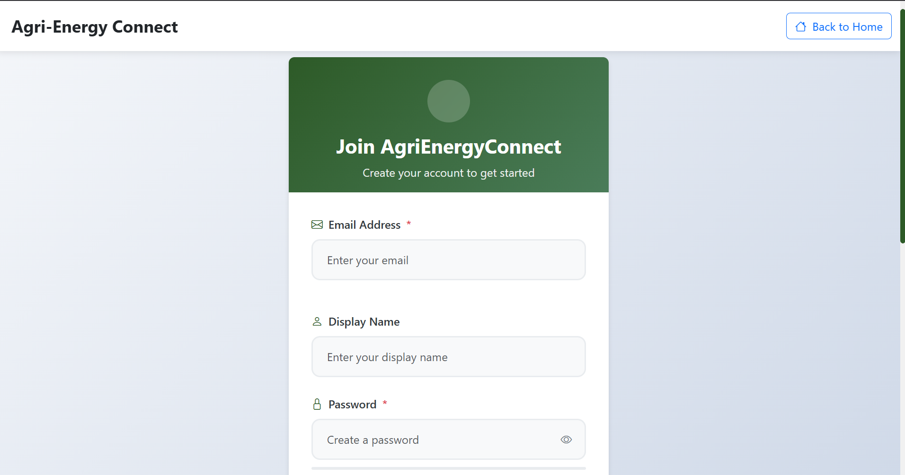
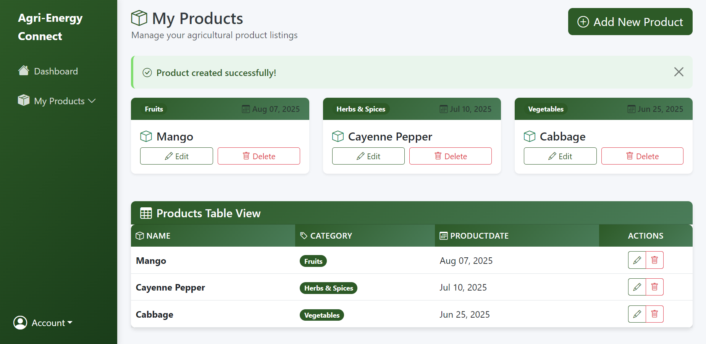

# 🌾 Agri-Energy Connect

A comprehensive web platform that enables collaboration between energy providers and farmers, facilitating sustainable agricultural practices and energy management.

## 📋 Table of Contents
- [Overview](#overview)
- [Tech Stack](#tech-stack)
- [Features](#features)
- [Prerequisites](#prerequisites)
- [Installation & Setup](#installation--setup)
- [Running the Application](#running-the-application)
- [Application Screenshots](#application-screenshots)
- [Project Structure](#project-structure)
- [Contributing](#contributing)

## 🌟 Overview

Agri-Energy Connect is a prototype platform designed to bridge the gap between energy providers and farmers. The application allows farmers to manage their crop information while enabling energy company employees to oversee farmer profiles and agricultural data.

## 🛠️ Tech Stack

### Backend Framework
- **ASP.NET Core 7.0** - Modern, cross-platform web framework for building robust web applications
- **C#** - Primary programming language providing type safety and performance
- **Entity Framework Core** - Object-relational mapping (ORM) for database operations and migrations

### Database
- **SQL Server** - Relational database management system for data persistence
- **ASP.NET Core Identity** - Authentication and authorization framework with role-based access control

### Frontend Technologies
- **Razor Pages** - Server-side rendering with C# integration for dynamic web pages
- **HTML5 & CSS3** - Modern web standards for structure and styling
- **JavaScript** - Client-side interactivity and form validation
- **Bootstrap** - Responsive CSS framework for mobile-first design
- **Font Awesome** - Icon library for enhanced user interface

### Development Tools
- **Visual Studio 2022** - Integrated development environment
- **Git** - Version control system
- **Entity Framework Migrations** - Database schema versioning and updates

### Security & Authentication
- **ASP.NET Core Identity** - User management, authentication, and authorization
- **Role-based Authorization** - Farmer and Employee role separation
- **Anti-forgery Tokens** - CSRF protection
- **Data Validation** - Input sanitization and model validation

## ✨ Features

### For Farmers
- 🌱 **Product Management** - Add, edit, and manage crop information
- 📊 **Dashboard** - View personal agricultural data
- 🔐 **Secure Authentication** - Personal account management

### For Employees
- 👥 **Farmer Management** - Register and manage farmer accounts
- 📈 **Data Overview** - Access to comprehensive farmer and crop data
- 🛡️ **Administrative Controls** - Employee-only functionality

### General Features
- 📱 **Responsive Design** - Works seamlessly on desktop and mobile devices
- 🎨 **Modern UI** - Clean, intuitive user interface
- 🔒 **Secure** - Industry-standard security practices
- ⚡ **Performance** - Optimized database queries and caching

## 📋 Prerequisites

Before running the application, ensure you have the following installed:

### Required Software
1. **.NET 7.0 SDK** or later
   - Download from: https://dotnet.microsoft.com/download
   - Verify installation: `dotnet --version`

2. **SQL Server** (LocalDB, Express, or Full)
   - SQL Server Express: https://www.microsoft.com/en-us/sql-server/sql-server-downloads
   - Or use SQL Server LocalDB (included with Visual Studio)

3. **Git** (for cloning the repository)
   - Download from: https://git-scm.com/downloads

### Optional but Recommended
- **Visual Studio 2022** or **Visual Studio Code**
- **SQL Server Management Studio (SSMS)** for database management

## 🚀 Installation & Setup

### 1. Clone the Repository
```bash
git clone https://github.com/ENM032/Agri-Energy-Connect.git
cd Agri-Energy-Connect
```

### 2. Navigate to Project Directory
```bash
cd AgriEnergyConnect/WebApplication2
```

### 3. Restore Dependencies
```bash
dotnet restore
```

### 4. Update Database Connection String
Edit `appsettings.json` and update the connection string if needed:
```json
{
  "ConnectionStrings": {
    "WebApplication2ContextConnection": "Server=(localdb)\\mssqllocaldb;Database=AgriEnergyConnect;Trusted_Connection=True;MultipleActiveResultSets=true"
  }
}
```

### 5. Apply Database Migrations
```bash
dotnet ef database update
```

### 6. Build the Application
```bash
dotnet build
```

## ▶️ Running the Application

### Development Mode
```bash
dotnet run
```

The application will start and be available at:
- **HTTP**: http://localhost:5291
- **HTTPS**: https://localhost:7291 (if configured)

### Production Mode
```bash
dotnet run --environment Production
```

### Default User Roles
The application automatically seeds two roles:
- **Farmer** - Can manage their own products and profile
- **Employee** - Can manage farmer accounts and view all data

## 📸 Application Screenshots

*Screenshots will be added here to showcase the application's user interface and functionality.*

### Login & Registration
<!--  -->
<!--  -->

### Dashboard Views
<!--  -->
<!--  -->

### Product Management
<!--  -->
<!--  -->

> **Note**: To add screenshots, create an `assets/screenshots/` folder in the project root and place your images there. Then uncomment and update the image paths above.

## 📁 Project Structure

```
AgriEnergyConnect/
├── WebApplication2/
│   ├── Areas/
│   │   └── Identity/          # Authentication pages and user management
│   ├── Controllers/           # MVC controllers for business logic
│   ├── Models/               # Data models and view models
│   ├── Views/                # Razor views for UI
│   ├── wwwroot/              # Static files (CSS, JS, images)
│   ├── Migrations/           # Entity Framework database migrations
│   ├── Program.cs            # Application entry point and configuration
│   └── appsettings.json      # Application configuration
├── SQL Preloads/             # Database initialization scripts
└── README.md                 # Project documentation
```

## 🤝 Contributing

This project was developed as part of a 3rd year university module. While it serves as a prototype, contributions and improvements are welcome.

### Development Guidelines
- Follow C# coding conventions
- Implement proper error handling
- Add unit tests for new features
- Update documentation for significant changes
- Ensure security best practices

---

**Developed with ❤️ using ASP.NET Core and modern web technologies**
